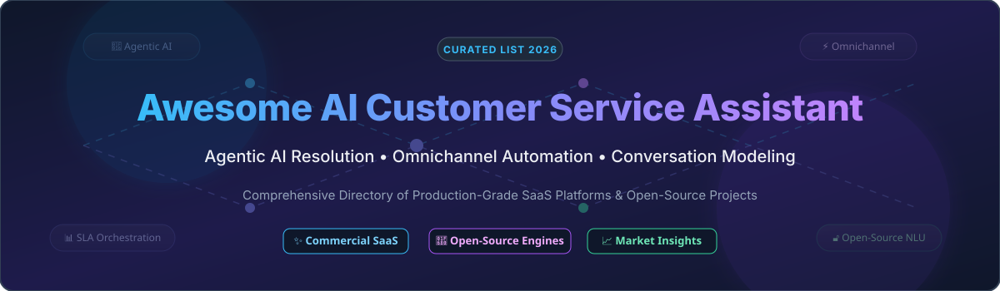

# 🤖 Awesome AI Customer Service Assistant

  

  
  
  
  
  

---

## 🌟 Overview & SEO Keywords

Welcome to the definitive, community-curated list of **AI Customer Service Assistants**, **Agentic AI Resolution Engines**, **Omnichannel Helpdesk Automation Platforms**, and **Open-Source Conversational AI Frameworks**. 

Whether you are looking to deploy an enterprise-grade AI support bot, orchestrate complex customer service SLAs, or build self-hosted conversation models, this directory features production-grade SaaS solutions and top open-source GitHub repositories.

---

## 📊 Market Overview & Industry Structure

> 💡 **Estimated Market Size & Industry Dynamics:**  
> The global **AI Customer Service & Contact Center Automation Market** is estimated at **$18.5 Billion (2026)** and projected to exceed **$45 Billion by 2030** (CAGR ~25%).  
> The sector is **moderately fragmented**: major CRM and helpdesk incumbents (*Microsoft, Zendesk, Freshworks*) command significant enterprise market share, while specialized high-valuation AI agent startups (*Sierra, Decagon, Parloa, Intercom*) are rapidly competing for market dominance through outcome-based pricing models.

---

## 📑 Table of Contents

- [🏢 SaaS / Commercial Platforms](#-saas--commercial-platforms)
- [🔓 Open-Source GitHub Projects](#-open-source-github-projects)
- [🤝 How to Contribute](#-how-to-contribute)
- [☕ Support & Sponsorship](#-support--sponsorship)
- [📈 Star History](#-star-history)
- [⚠️ Disclaimer](#%EF%B8%8F-disclaimer)

---

## 🏢 SaaS / Commercial Platforms

The table below summarizes commercial AI customer service solutions, ordered by **Company Size / Valuation (Descending)**.

| Company / Product | Product Overview | Valuation / Revenue | Starting Price | Free Tier / Trial Limit |
| :--- | :--- | :--- | :--- | :--- |
| **[Microsoft Copilot for Service](https://learn.microsoft.com/en-us/microsoft-copilot-service/about-microsoft-copilot-for-service)** 🤖 | **AI assistant for customer service reps** embedded across M365, Outlook, Teams, and CRMs (Salesforce, Zendesk). | **$3.8 Trillion** *(Microsoft Market Cap)* | **$50 / user / month** *(Requires M365 base license)* | **30-Day Free Trial** *(Up to 25 seats via Admin Center)* |
| **[Sierra](https://sierra.ai/)** 🚀 | **Outcome-focused enterprise AI agents** operating across weeks/months with long-term memory & Context Engine. | **$15.8 Billion** *(Latest Valuation)* | **Outcome-based custom enterprise pricing** | **No public free tier** *(Custom enterprise proof-of-concept)* |
| **[Zendesk AI](https://www.zendesk.com/)** 🛠️ | **Autonomous Service Workforce vision** with plain-language action flows and native CRM orchestration. | **$10.2 Billion** *(Acquired by H&F / Permira)* | **$55 / agent / month** *(Suite Team base plan)* | **14-Day Free Trial** *(Full access, no credit card required)* |
| **[Decagon](https://decagon.ai/)** 🎙️ | **AI concierge with advanced voice capabilities (Chord model)** & Personal Agent Gateway. | **$4.5 Billion** *(Latest Valuation)* | **Custom enterprise contract** | **No public free tier** *(Interactive web demo on request)* |
| **[Freshdesk Freddy AI](https://crmsupport.freshworks.com/support/solutions/articles/50000010359/thumbs_down)** 🌿 | **Omnichannel AI Copilot, Insights & Agent Studio** for automated ticketing and resolution. | **$3.5 Billion** *(Freshworks Market Cap)* | **$49 / 100 sessions** *(Freddy AI Agent)* / **$29 / agent / mo** *(Copilot)* | **21-Day Free Trial** *(Full Freshdesk Freddy AI suite access)* |
| **[Parloa](https://www.parloa.com/)** 🌐 | **Cloud-native conversational AI agents** for multi-lingual contact centers and phone call routing. | **$3.0 Billion** *(Latest Valuation)* | **Custom enterprise contract** | **No public free tier** *(Custom sandbox environment upon request)* |
| **[Intercom Fin](https://www.intercom.com/help/en/articles/9515824-what-is-fin)** ⚡ | **Fin AI Engine™ resolving up to 76% of support queries** adaptively across messaging and email. | **$1.6 Billion** *(Latest Valuation)* | **$0.99 per resolution** *(Fin AI Agent)* | **14-Day Free Trial** *(Full access to Intercom & Fin AI Agent)* |
| **[Cresta](https://cresta.com/)** 🧠 | **AI agent lifecycle management**, Synthetic Customer personas for testing, and Conductor agent builder. | **$1.6 Billion** *(Latest Valuation)* | **Custom enterprise platform licensing** | **No public free tier** *(Live custom demo & benchmark assessment)* |
| **[Ada](https://www.ada.cx/)** 💬 | **Unified Reasoning Engine** bridging voice, email, and messaging with automated action flows. | **$1.2 Billion** *(Latest Valuation)* | **Custom enterprise package** *(Base platform + resolution fees)* | **No public free tier** *(Custom guided trial for enterprises)* |
| **[Forethought](https://forethought.ai/)** 💡 | **Generative AI customer service pioneer** *(Acquired by Zendesk in March 2026)*. | **Acquired by Zendesk** | **Integrated into Zendesk Enterprise** | **Integrated into Zendesk trial & enterprise plans** |

---

## 🔓 Open-Source GitHub Projects

Below is a list of top open-source repositories for building self-hosted, custom AI customer service tools, sorted by **GitHub Star Count (Descending)**.

| Project Name | Stars | License | Core Capabilities & Best Use Case |
| :--- | :--- | :--- | :--- |
| **[Chatwoot](https://github.com/chatwoot/chatwoot)** 💬 |  | `MIT` | **Omnichannel customer support desk alternative to Intercom & Zendesk.** Connects website chat, WhatsApp, Twitter, and email with AI bot integrations. |
| **[Rasa](https://github.com/RasaHQ/rasa)** 🧠 |  | `Apache-2.0` | **Mature open-source conversational AI framework.** Features NLU pipelines, CALM dialogue management, intent classification, and custom Python actions. |
| **[Parlant](https://github.com/emcie-co/parlant)** 🎯 |  | `Apache-2.0` | **Conversation modeling engine for reliable AI agents.** Enforces strict behavioral guidelines, domain glossaries, and self-critique mechanisms for regulated industries. |
| **[Botpress](https://github.com/botpress/botpress)** 🎨 |  | `MIT` | **Visual builder platform for AI agents with LLM support.** Drag-and-drop workflow designer, knowledge base grounding, and multi-channel connectors. |
| **[Papercups](https://github.com/papercups-io/papercups)** 📦 |  | `MIT` | **Open-source live customer chat software.** Built with Elixir/Phoenix, lightweight, customizable, and easily embeddable into React and web apps. |
| **[cx-cloud-ai](https://github.com/cx-cloud-ai/cx-cloud-ai)** ⚡ |  | `MIT` | **Distributed AI contact center orchestration primitives.** Smart intent routing, agent state management, SLA monitoring, and PII redact audit logging. |

---

## 🤝 How to Contribute

Contributions are welcome! Please follow these simple guidelines:

1. 🍴 Fork the repository.
2. 📝 Add or update entries in `README.md` following the tabular format.
3. 📌 Ensure pricing, free trial limits, valuation, or star counts are factual and cited.
4. 🚀 Submit a Pull Request with a clear description of changes.

---

## ☕ Support & Sponsorship

If you find this repository helpful for your research, team, or project, please consider supporting it!

- ⭐ **Star** this repository to show your appreciation.
- 🔄 **Fork** and share it with fellow CX engineers and AI developers.
- 💖 **Buy me a coffee / Sponsor**: Support ongoing maintenance and curated updates on the [GitHub Sponsor Dashboard](https://github.com/sponsors/ishandutta2007).

  

---

## 📈 Star History

---

## ⚠️ Disclaimer

- This list is **community-curated** for informational and research purposes only.
- AI customer service platforms handle sensitive user data; ensure full compliance with GDPR, CCPA, and enterprise privacy standards before deployment.
- **Open-source ecosystem state**: Commercial SaaS platforms currently offer more turnkey omnichannel integrations and out-of-the-box resolutions, whereas open-source frameworks provide superior data control, custom behavior modeling, and self-hosted infrastructure flexibility.

---

  Made with ❤️ for CX leaders, AI engineers, and contact center architects.

